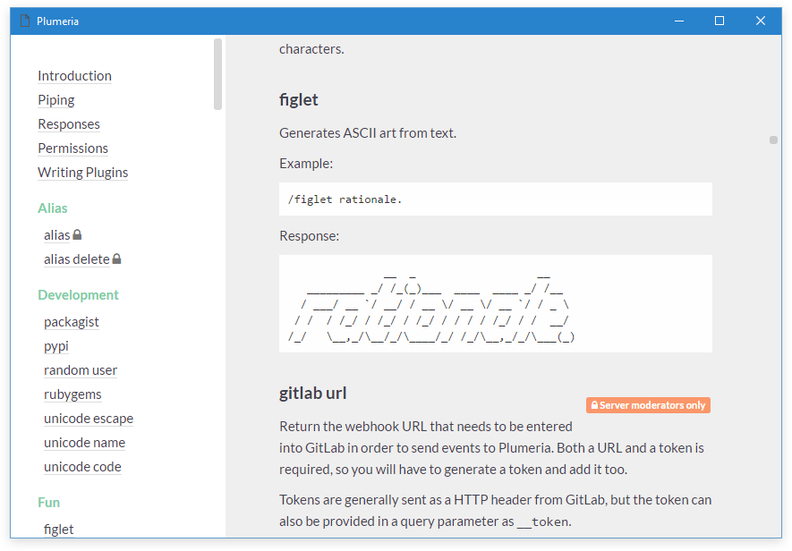

# Plumeria, the Discord bot

Plumeria is a fun & practical Discord bot for your Discord server. As Plumeria is fairly powerful, it is meant to be self-hosted by running the software on your computer or, preferably, on some sort of server.

The software is designed to work on Windows, Mac OS X, and Linux.

## Features

Plumeria has a *long* list of commands and most of the commands are non-trivial. Unique to Plumeria, however, is the ability to combine commands. **You can chain the output of one command to the input another,** which lets you quickly build awesome combinations. Save these awesome combination as aliases and refer to them repeatedly.

Here are some examples:

* Searching the Internet for an image and overlaying text on it: 
  `.image harambe | memetext2 screw this zoo, man`
* Getting the top tracks for a music tag on last.fm and finding a YouTube video for it:
  `.tagtop rock | youtube`
* Choosing between several entries:
   `.choice pizza Chinese | echo What's for dinner?`
* Drawing a pie graph of some Strawpoll.me results:
  `.results 18233 | pie`
* Convert the previously posted image to a .vtf file
  `.last image | make spray`
* Putting a frame of hearts around an image of "harambe" (uses variables):
  `i harambe | put url | render 

`
* Blending two images from Bing image search together (uses variables):
  `i adtr | put a | i knuckle puck | put b | render 

`

## Command List

**Alias**

* alias
* alias delete

**Development**

* pypi
* rubygems
* unicode escape
* unicode name
* unicode code
* packagist
* random user

**Discord**

* roles
* user id

**Electronics**

* resistors

**Fun**

* dudu
* figlet

**Games**

* osu sig
* osu stats
* minecraft status
* minecraft uuid
* minecraft body
* minecraft head
* minecraft face
* minecraft skin
* minecraft cape

**GitLab**

* gitlab url
* gitlab addtoken
* gitlab removetoken
* gitlab tokens
* gitlab subscribe
* gitlab unsubscribe
* gitlab subscriptions

**Graphing**

* pie
* bar
* histogram
* graph
* digraph

**Image**

* qrcode
* tex
* make spray
* fetch image
* memetext
* memetext2
* drawtext
* blur
* edge enhance
* emboss
* find edges
* sharpen
* bw

**Music**

* soundcloud
* artist charts
* charts
* lyrics
* lastfm
* lastfm tag
* spotify artist
* spotify track
* spotify album

**Operations**

* push
* pop
* put
* get
* argparse

**Search**

* cve
* similar music
* similar movies
* similar shows
* similar books
* similar authors
* similar games
* wolfram
* urban
* woot
* abstract
* cheapshark
* recipes
* strawpoll
* strawpoll results
* xkcd
* image
* gravatar
* subreddit
* reddit
* beer
* latlng
* directions
* earthquakes
* youtube
* imdb

**Servers**

* a2squery

**Statistics**

* mean
* median
* median low
* median high
* median grouped
* mode
* pstdev
* pvariance
* stdev
* variance

**Steam**

* steam id
* steam profile
* steam avatar
* steam id64
* steam id32
* steam status

**String**

* upper
* lower
* rot13
* idna
* punycode
* base64
* base64dec
* md5
* sha1
* sha224
* sha256
* urlescape
* unurlescape
* length
* findurl
* uuid
* dashuuid
* hexuuid

**Utility**

* help
* commands dump
* timestamp
* 8ball
* roll
* choice
* coin
* last text
* last image
* last url
* uptime
* update
* screenshot
* screenshot mobile
* render crop
* render full
* echo

## License

The project is licensed under the MIT license.
